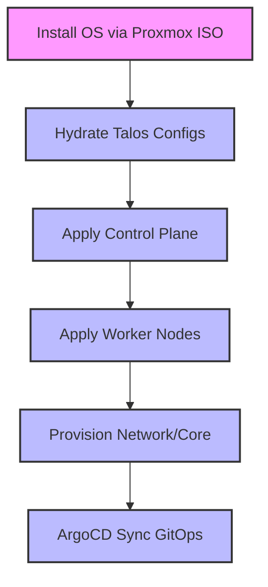

# Talos Homelab Bootstrap Guide

This directory contains the declarative infrastructure to provision and maintain the bare metal Kubernetes cluster using Talos.

## Workflow



## Directory Structure

```
bootstrap/
├── athena.zsh              # Node IPs and cluster vars (sourced by apply scripts)
├── mise.toml               # Tool versions (talosctl, etc.)
├── talos/
│   ├── *.template.yaml     # Committed templates with {{ dotted.key }} placeholders
│   ├── *.yaml              # Hydrated configs (gitignored, contain secrets)
│   ├── apply-control.sh    # Applies controlplane.yaml to control plane nodes
│   └── apply-worker.sh     # Applies worker.yaml to worker nodes
└── kubernetes/
    └── provision.sh        # Installs Cilium, ArgoCD, Gateway, etc.
```

## Order of Operations

1. **Pre-requisites**
   - Ensure Proxmox VMs are booted with the Talos ISO.
   - Run `mise install` to ensure `talosctl` and helpers are available.
   - Ensure you are logged into 1Password CLI (`op signin`).

2. **Hydrate Node Configurations**
   - Secrets are stored as a single 1Password Secure Note (item ID configured in `tools-workflow/.env` as `OP_TALOS_ITEM_ID`).
   - The `.template.yaml` files in `talos/` use `{{ dotted.key }}` placeholders that map to flattened YAML paths in the note.
   - Generate the configs:
     ```bash
     cd tools-workflow
     bundle exec ruby workflow.rb render-talos
     ```
   - This writes hydrated YAML files (e.g. `controlplane.yaml`, `worker.yaml`) into `talos/` alongside the templates.

3. **Deploy the Cluster**
   ```bash
   cd bootstrap/talos
   ./apply-control.sh    # Applies config to all control plane nodes
   ./apply-worker.sh     # Applies config to all worker nodes
   ```

4. **Provision Core Applications**
   ```bash
   cd bootstrap/kubernetes
   ./provision.sh
   ```
   This installs gateway-api, Helm, Cilium, creates the L2 announcement pool, installs ArgoCD, and creates the Gateway.

5. **ArgoCD App of Apps Integration**
   - Obtain the ArgoCD initial admin password (printed by `provision.sh`).
   - ArgoCD connects to GitHub via `ExternalSecrets` backed by 1Password (configured in `cluster/apps/argocd-github-repo-pmn.yaml`).
   - Sync the top-level workload manifests.
