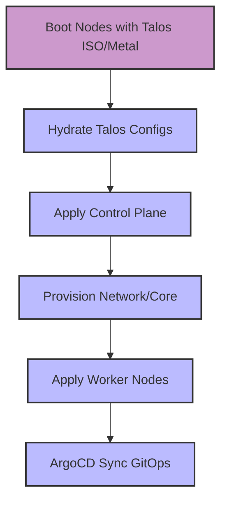

# Talos Homelab Bootstrap & Disaster Recovery Guide

This directory contains the declarative infrastructure to provision and maintain the bare metal Kubernetes cluster using Talos. It also serves as the disaster recovery (DR) playbook for rebuilding the cluster from scratch.

> **Planned power-down instead?** For a rack move or other planned full-cluster
> shutdown, use [docs/runbook-planned-shutdown.md](../docs/runbook-planned-shutdown.md) —
> nothing in this DR playbook needs to be re-run for that.

## Workflow


```mermaid
graph TD
    classDef manual fill:#c9c,stroke:#333,stroke-width:2px;
    classDef auto fill:#bbf,stroke:#333,stroke-width:2px;

    A[Boot Nodes with Talos ISO/Metal]:::manual --> B[Hydrate Talos Configs]:::auto;
    B --> C[Apply Control Plane]:::auto;
    C --> D[Provision Network/Core]:::auto;
    D --> E[Apply Worker Nodes]:::auto;
    E --> F[ArgoCD Sync GitOps]:::auto;
```

## Directory Structure

```text
bootstrap/
├── athena.template.zsh     # Template for athena.zsh — copy and fill in real values
├── athena.zsh              # Node IPs and cluster vars (gitignored; sourced by apply scripts)
├── mise.toml               # Tool versions (talosctl, etc.)
├── talos/
│   ├── *.template.yaml     # Committed templates with {{ dotted.key }} placeholders
│   ├── *.yaml              # Hydrated configs (gitignored, contain secrets)
│   ├── apply-control.sh    # Applies controlplane.yaml to control plane nodes
│   └── apply-worker.sh     # Applies worker.yaml to worker nodes
└── kubernetes/
    ├── provision.sh        # Installs Gateway API, Helm, Cilium, and ArgoCD (Helm chart)
    ├── cilium-values.yaml  # Cilium Helm values (single source of truth for CNI config)
    ├── argocd-values.yaml  # ArgoCD bootstrap values (adopted by cluster/core/argocd after root sync)
    └── load1p-account-token.sh # Injects 1Password Token for External Secrets
```

> **Note:** `athena.zsh` is gitignored, so a fresh clone cannot run the DR
> playbook until it is recreated from `athena.template.zsh`. Keep the real
> copy backed up outside git (e.g. in the same 1Password vault as the Talos
> secrets note).

## Order of Operations (Disaster Recovery Playbook)

If you are rebuilding the cluster (e.g., late night disaster recovery), follow these steps in exact order to ensure a stable cluster state before workloads are synced.

### 1. Pre-requisites

- Ensure your Hypervisor (Proxmox) VMs are booted with the Talos ISO.
- Run `mise install` locally to ensure `talosctl` and `kubectl` match the cluster versions.
- Ensure you are logged into the 1Password CLI (`op signin`).

### 2. Hydrate Node Configurations

Secrets are stored as a single 1Password Secure Note (item ID configured in `tools-workflow/.env` as `OP_TALOS_ITEM_ID`). The `.template.yaml` files use placeholders that map to this note.

- Navigate to your `tools-workflow` repository.
- Generate the configs:

  ```bash
  bundle exec ruby workflow.rb render-talos
  ```

- This writes the hydrated, secret-injected YAML files (e.g., `controlplane.yaml`, `worker.yaml`) into `bootstrap/talos/` alongside the templates.

### 3. Control Plane Reprovisioning

Wait for the control plane VMs to enter Talos maintenance mode.

```bash
cd bootstrap/talos
./apply-control.sh
```

Trigger the `etcd` bootstrap on the first control plane node:

```bash
talosctl --nodes $BOOTSTRAP_NODE bootstrap
```

Pull down and integrate the new cluster kubeconfig:

```bash
talosctl --nodes $BOOTSTRAP_NODE kubeconfig ~/.kube/config-athena
diff ~/.kube/config ~/.kube/config-athena
nano ~/.kube/config
```

### 4. Provision Core Infrastructure (CNI & Gateway)

*Important: Do not apply worker configurations until the CNI is established.*

```bash
cd bootstrap/kubernetes
./provision.sh
```

This script installs Gateway API, Helm, Cilium, creates the L2 announcement pool, and installs ArgoCD.
*Note: The control plane nodes will transition from `NotReady` to `Ready` once Cilium is fully running.*

### 5. Worker Node Reprovisioning

Boot your worker nodes (e.g., Raspberry Pi metal images). Once they are online and in maintenance mode, apply their configuration:

```bash
cd bootstrap/talos
./apply-worker.sh
```

Because the CNI is already active on the control plane, these nodes should successfully join and quickly transition to `Ready`.

**Worker storage.** Workers boot from SD, but their EPHEMERAL volume (all of
`/var`) goes on their NVMe via the `VolumeConfig` at the end of
`worker.template.yaml`. Placement is decided when EPHEMERAL is first created,
so a fresh worker gets it at install, provided its NVMe has free space. An
original worker's Optane still carries stale partitions until the runbook's
clear step. To move an existing worker whose
EPHEMERAL is still on the SD, use
[docs/runbook-worker-ephemeral-relocation.md](../docs/runbook-worker-ephemeral-relocation.md).
Check the placement with `talosctl -n <ip> get volumestatus EPHEMERAL`.

**Do not `talosctl upgrade` workers from the template's `install.image`.**
The workers are CM5 Lites on a community build; see the warning on that line.

**Scratch workers.** These are the nodes listed in `NVME_WORKER_IP`: CM5 Lites
with a 128 GB NVMe, meant for GitHub runners and other workloads that need a
lot of disk but keep nothing. They get the same `worker.yaml` plus
`worker-nvme.patch.yaml`, which adds the label `athena.asn.casa/scratch=nvme`
and a matching `PreferNoSchedule` taint. `apply-worker.sh` applies both. Things
to get right:

- **Same image as the other workers.** Flash exactly the image the existing
  workers run, and compare `talosctl version` (Tag and SHA) against an existing
  worker while the new node is still in maintenance mode, before applying
  anything.
- **Same address range.** The observability rule above applies to these nodes
  too.
- **After joining, confirm the NVMe placement:**
  - `talosctl -n <ip> get volumestatus EPHEMERAL` shows `nvme0n1`;
  - the node's `ephemeral-storage` is roughly 119 GiB, less filesystem overhead;
  - `kubectl describe node` shows the label and taint.

**Worker addresses are not a free choice.** Observability lives outside the
cluster, and the stores accept telemetry only from a defined range of node
addresses — cluster egress masquerades, so a Vector pod arrives as its node
address. Take the current range from the infrastructure repo before assigning
one. A worker outside it looks completely healthy while shipping nothing:
Vector stays `Ready` and buffers. `AthenaNodeLogsGone` catches that within 15
minutes.

### 6. GitOps Workload Sync (ArgoCD App of Apps)

ArgoCD is now running, but it cannot sync workloads from GitHub until the External Secrets Operator is authenticated to 1Password.

1. **Inject 1Password Credentials:**
   Export your active 1Password Service Account Token, then run the loader (the token is read from the environment — never edit it into the script):

   ```bash
   export OP_SERVICE_ACCOUNT_TOKEN="$(op read 'op://<vault>/<item>/credential')"
   cd bootstrap/kubernetes
   ./load1p-account-token.sh
   cd ../../
   ```

2. **Apply the Root Application:**
   Instead of applying manifests manually, apply the top-level "App of Apps". This single command tells ArgoCD to recursively sync both `cluster/core` (External Secrets Operator) and `cluster/apps` (Workloads). ArgoCD respects sync waves, ensuring CRDs are installed before secret manifests are parsed.

   ```bash
   kubectl apply -f cluster/root.yaml
   ```

   *(Note: You may see a `metadata.finalizers` warning from Kubernetes about the `resources-finalizer.argocd.argoproj.io` format. This is a harmless Kubernetes validation warning that can be safely ignored).*

The cluster is now fully rebuilding itself declaratively. Grab a coffee and watch the sync via the ArgoCD UI.
