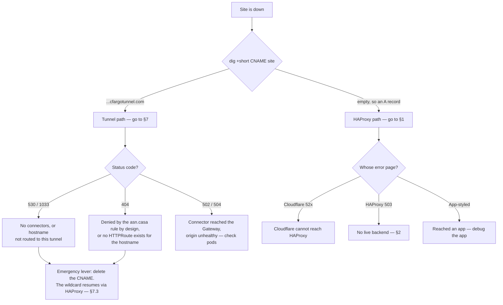

# Runbook — a public site is down

Triage path for "one of our sites is down", written after chuvar.ai went dark
with no alert and extended when a second serving path appeared. The whole point
is to identify **which layer** is failing before touching anything: every hop
in the chain can produce a failure, and from a browser they all look alike.

If you are reading this at 2am and want the site back before you understand
why, skip to **§7.3** — but check §0 first, because that lever only exists on
one of the two paths.

Placeholders throughout — `<edge-proxy-host>`, `<backend-ip>`, `<site>`.
Concrete hosts live in the private infrastructure repo, not here.

**There are now two serving chains, and a hostname uses one or the other.**
Establishing which one you are debugging is the first move — most of the
symptoms below mean different things on each path.

    Cloudflare (proxied DNS)
      ├─ A record → edge proxy (HAProxy) → origin
      │                                     ├─ cluster Gateway :443 → HTTPRoute → Service → pod
      │                                     └─ or a legacy host/port (pre-migration)
      └─ CNAME to *.cfargotunnel.com → tunnel → connector pod (outbound only)
                                                 └─ cluster Gateway :8443 → HTTPRoute → Service → pod

The tunnel path exists because the A-record path points at a static ISP address
that changes when the site fails over to its backup WAN — which takes every
proxied hostname down until DNS is edited by hand. Connectors dial out, so
there is no origin address to go stale.



---

## 0. Which path is this hostname on?

    dig +short CNAME <site>

A `*.cfargotunnel.com` answer means the tunnel. An empty answer means an A
record — either the hostname's own, or a wildcard covering it — and therefore
HAProxy.

Do this before reading any status code. A 503 on the HAProxy path and a 530 on
the tunnel path have nothing to do with each other, and the fix for one does
nothing for the other.

---

## 1. Fingerprint the 503 — whose error page is it?

```bash
curl -sS -D - -o /dev/null https://<site>/
curl -sS https://<site>/ | head -20
```

Read the **body and headers together**; the status code alone says nothing.

| Evidence | Failing layer |
|---|---|
| Cloudflare-branded error page, status 52x/530 | Cloudflare cannot reach the edge proxy at all (tunnel/host/network down) |
| `server: cloudflare` + `cf-cache-status: DYNAMIC` + plain `<h1>503 Service Unavailable</h1>` / "No server is available to handle this request." | **HAProxy's own error page.** Cloudflare reached the edge proxy fine; the proxy has no live server in the backend for this host. Go to §2 |
| App-styled or framework error page | Request reached an app; debug the app, not the network |
| Cloudflare 520/525/526 | Origin answered but malformed/TLS mismatch — check HAProxy mode (http vs TCP passthrough) for that host |

"No server is available to handle this request" is HAProxy's stock 503 —
that one sentence localises the fault to *behind* the edge proxy.

## 2. Find the route on the edge proxy

```bash
ssh root@<edge-proxy-host> "grep -n -i '<site>' /etc/haproxy/haproxy.cfg"
```

Two hits matter: the `use_backend ... if { hdr(host) -i <site> }` line (and,
for TLS-passthrough hosts, an SNI ACL) and the `backend` block it names,
whose `server` line gives `<backend-ip>:<port>`.

Note which arrival path the site uses:
- **Cloudflare Flexible SSL** (no certbot cert for the zone on the proxy):
  Cloudflare speaks plain HTTP to the origin, so only the `:80` frontend's
  `use_backend` line routes it.
- **Full/strict SSL or direct**: the `:443` SNI ACL matters too. Cutover
  edits must cover both (two edits per host).

## 3. Probe the backend from the proxy

```bash
ssh root@<edge-proxy-host> \
  "ping -c1 -W2 <backend-ip> >/dev/null && echo host-up || echo host-down; \
   timeout 3 bash -c '</dev/tcp/<backend-ip>/<port>' && echo port-open || echo port-closed"
```

- **host-down** — the machine is gone; check the hypervisor.
- **host-up + port-closed** — the machine survived but the service didn't
  (common for dev-host origins: a reboot, and whatever `bun run dev` /
  container was serving never came back). Decide whether to resurrect it or
  treat this as the forcing function to deploy properly (§5).
- **port-open** — HAProxy's health check is failing for another reason
  (wrong `check` port, app up but unhealthy). Check
  `echo 'show stat' | socat stdio /run/haproxy/admin.sock` if the admin
  socket exists, else the app's own logs.

## 4. If the origin is (supposed to be) the cluster

```bash
kubectl get httproute -A            # is the hostname routed at all?
kubectl get applications -n argocd   # is the app Synced/Healthy?
kubectl -n <ns> get pods -l app=<app>
```

No HTTPRoute for the hostname = the site was **never migrated** — nothing in
the cluster answers for it regardless of pod health. Check the Gateway has an
HTTPS listener + Certificate for the host (`cluster/core/networking/`), then
the app manifests under `cluster/apps/`.

## 5. Bringing a dead static site onto the cluster instead

The established pattern (spritz-marketing, counta — copy, don't reinvent):

1. **Image**: static build served by Caddy on distroless, port 8080
   (`marketing/Dockerfile` in the spritz repo, or chuvar-web's `Dockerfile`).
   Published to ghcr by the repo's `docker` workflow; pin the `sha-<commit>`
   tag in gitops.
2. **Which Cloudflare account owns the zone?** Compare assigned nameserver
   pairs: `dig +short NS <zone>` — zones in the same account share the same
   NS pair. A zone in the simplytics account must be listed in the
   `dnsZones` selector of **both** ClusterIssuers
   (`cluster/core/cert-manager/letsencrypt-issuers.yaml`); its token is
   account-wide, so no token change.
3. **Certificate** in `cluster/core/networking/certificates.yaml` —
   sync-wave `"3"` if issued by the second (simplytics) solver, `"1"` only
   for personal-account zones. Getting this wrong deadlocks cluster-core.
4. **Gateway listener** in `gateway.yaml`, **app manifests** under
   `cluster/apps/<ns>/<app>/`, **Argo Application** under `cluster/apps/`.
5. **Cutover on the edge proxy** — after the pod is Ready and the cert
   issued. Back up `haproxy.cfg` first, run `haproxy -c -f` and compare the
   warning count against the backup (the config has pre-existing warnings;
   "warnings found" alone means nothing). For a Flexible-SSL host, repoint
   the `:80` `use_backend` line at the cluster-gateway bridge backend; add
   the `:443` SNI ACL as well so a later switch to Full SSL doesn't
   silently break.
6. **Verify from outside**: `curl -sS -o /dev/null -w '%{http_code}' https://<site>/`
   and a deep path, then re-check the HAProxy error counters are quiet.

## 6. Why was there no alert? (fix that too)

Since the tunnel became a serving path, three more alerts matter, and they live
with the rest of the rules in the private infrastructure repo:
`TunnelConnectorsDegraded` (a tunnel below its expected connection count),
`TunnelConnectorsCritical`, and per-tunnel `absent()` rules. The last are
spelled out one per tunnel deliberately — a vanished series cannot be caught by
a threshold, because the group simply stops being produced and reads as silence
rather than as zero.

The public-site probes still cover the outside path and need no change: they
follow whatever DNS says, which is the point.

A site can be 503 for days if nothing probes it end-to-end. Uptime checks
belong at the outermost layer (probe the public URL, not the pod). If the
site that paged you wasn't probed, add it to the external check list as part
of the same incident — the runbook run isn't done until the *next* failure
would have paged.

---

**Case notes — chuvar.ai, 2026-08-25.** Fingerprint was HAProxy's stock 503;
backend was a dev-host origin, host-up/port-closed (same failure counta.click
had before its cutover). No HTTPRoute existed — the site had never been
migrated. Resolution was §5: chuvar-web got a Dockerfile + docker workflow,
gitops grew the issuer zone, certificate, listener and app manifests, and the
edge proxy was repointed. Zone confirmed simplytics-account by NS-pair
comparison.

---

## 7. The tunnel path

Reached here from §0 because the hostname is a CNAME to `*.cfargotunnel.com`.

### 7.1 Fingerprint

| Evidence | Meaning |
|---|---|
| Cloudflare **1033** / **530** | The tunnel has no healthy connectors, or this hostname is not routed to the tunnel at all. Go to §7.2 |
| **404**, and the same hostname works through HAProxy | Either the hostname is under `asn.casa`, where the tunnel's deny rule refuses it **by design**, or no HTTPRoute exists for it at all |
| **502 / 504** | The connector reached the Gateway and the origin is unhealthy. This is an ordinary app problem — §3, §4 |
| **200** | This hostname is fine; you are debugging the wrong one |

**Do not go hunting for a missing `https-tunnel` parentRef.** Public routes
name that listener, but it does not gate anything: Cilium serves every route on
the Gateway through the hostname-less listener whether or not the route names
it. Measured, and re-checked while writing this — hostnames that never opted in
still return 200 through `:8443`. The parentRef is intent and future-proofing,
not a switch.

So a 404 here has two real causes. Check the cheap one first:

```bash
kubectl get httproute -A | grep <site>
```

Nothing listed means no route exists, which is an ordinary missing-manifest
problem — §4. If a route does exist and the hostname is under `asn.casa`, the
tunnel's deny rule refused it deliberately: that zone is never served over a
tunnel, and the fix is to give the site a hostname outside it, not to weaken
the rule.

### 7.2 Are there connectors?

```bash
kubectl -n cloudflared get pods -L tunnel
```

Two per tunnel, and **there are two tunnels** because the zones span two
Cloudflare accounts. One tunnel can be dead while the other is fine, which
takes down half the public hostnames and leaves the rest untouched.

Registered connections, not pod readiness, is the real signal — a connector can
be `Running` while registered with nothing. A healthy tunnel sums to 8:

```bash
kubectl -n cloudflared port-forward <pod> 12000:2000 &
curl -s localhost:12000/metrics | grep cloudflared_tunnel_ha_connections
```

If connectors are absent or unregistered, check their logs for the edge dial.
Connectors need outbound **UDP 7844** for QUIC and fall back to TCP 443, so
rule out egress before touching config.

### 7.3 The 2am lever: put it back on HAProxy

**This is the fastest way to stop the bleeding, and it is safe.** HAProxy has
been serving the whole time; the cutover was adding a DNS record, so rollback
is deleting it. The wildcard resumes immediately.

Delete the hostname's CNAME in the Cloudflare dashboard — the record carries a
comment saying exactly this — or:

```bash
curl -s -X DELETE -H "Authorization: Bearer $CF_TOKEN" \
  "https://api.cloudflare.com/client/v4/zones/<zone-id>/dns_records/<record-id>"
```

Then confirm it actually moved, rather than assuming:

```bash
dig +short CNAME <site>        # must now be empty
curl -sI https://<site>/ | head -1
```

Do this first and diagnose afterwards. Nothing about the tunnel needs to be
understood at 2am to get the site back.

### 7.4 What this path cannot fix

A bad release. Both availability zones sync the same manifests, so an image
bump lands everywhere at once. The tunnel protects against the link and the
site failing, never against the code. The remedy there is unchanged: staging
first, and a revert is a one-line image change.
